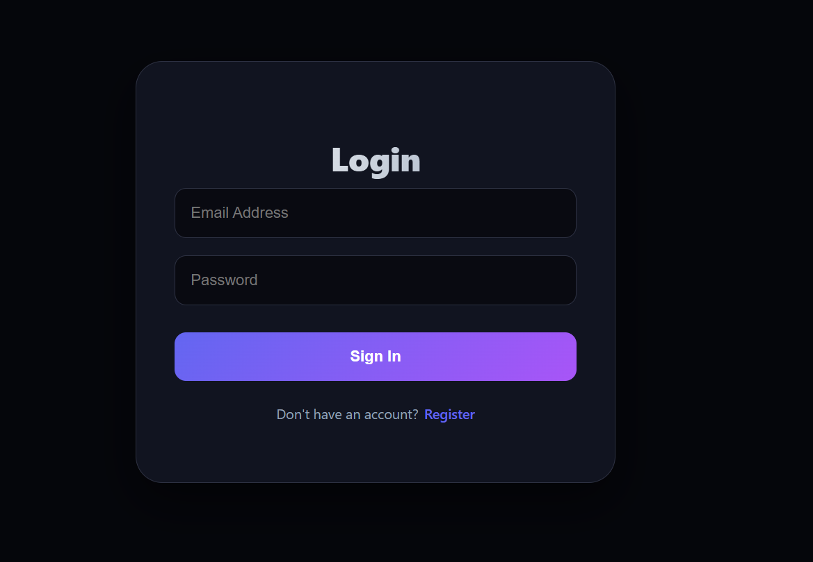
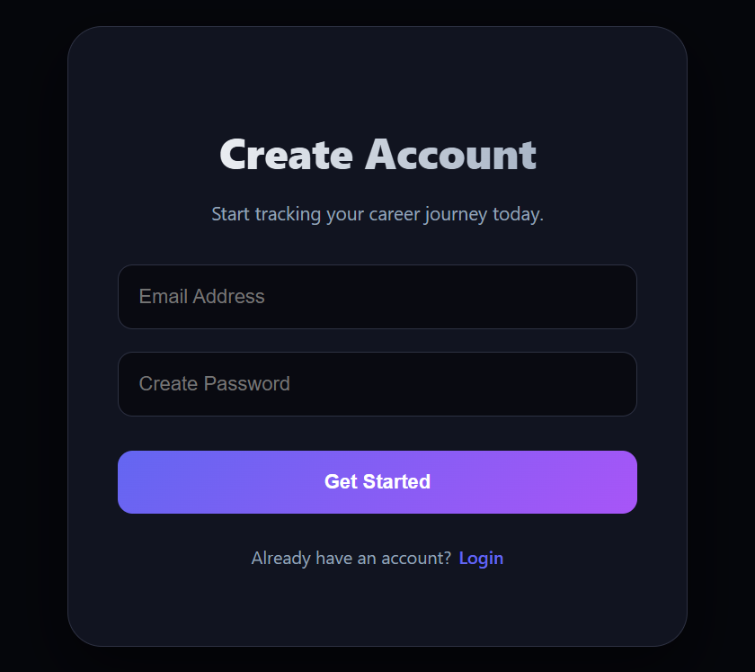
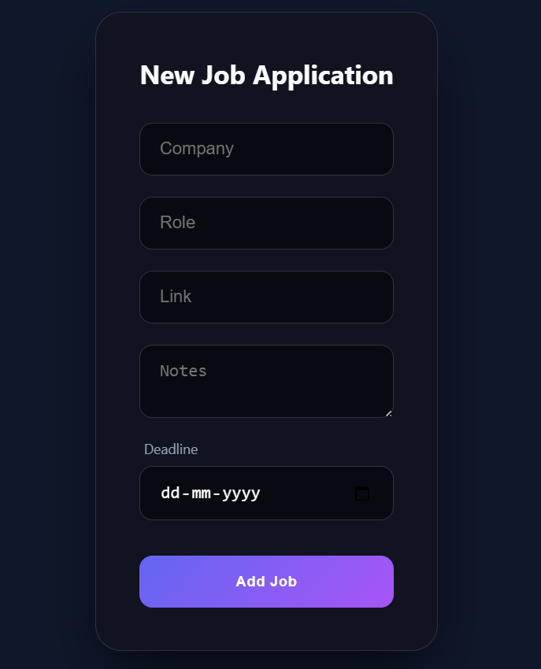
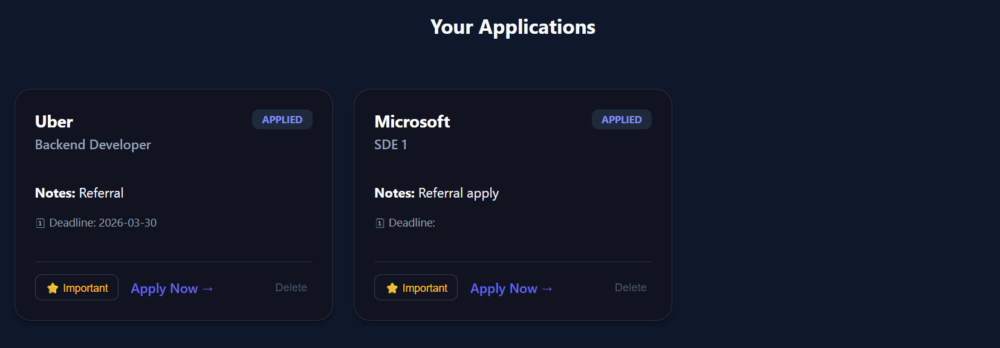
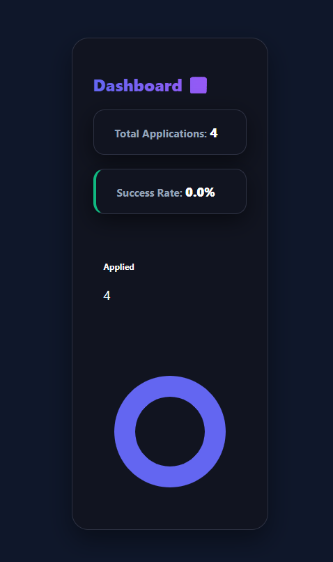

# 🚀 JobPilot — Smart Job Application Tracker

> Stop applying blindly. Start tracking, analyzing, and improving your job search.

---

## 🧠 What is JobPilot?

JobPilot is a **full-stack job application tracking system** that helps you:

* Track all your job applications in one place
* Monitor deadlines and important updates
* Analyze your application success rate
* Get insights to improve your job search strategy

Unlike basic trackers, JobPilot focuses on **data + decision-making**, not just storage.

---

## 🎯 Problem It Solves

Most students:

* Apply randomly
* Forget deadlines
* Don’t track progress
* Have no idea why they’re not getting interviews

👉 JobPilot fixes this by turning your job search into a **structured, trackable process**

---

## ✨ Features

### 📌 Core Features

* Add job applications (company, role, link)
* Track status:

  * Applied
  * Interview
  * Offer
  * Rejected
* Notes + deadlines for each job
* Delete & update applications

---

### 🔍 Smart Tracking

* Search by company or role
* Filter by status
* Timeline sorting (latest first)

---

### 🔔 Productivity Boosters

* Deadline alerts (highlight urgent applications)
* Mark important jobs ⭐

---

### 📊 Dashboard & Analytics

* Total applications count
* Status-wise breakdown
* Pie chart visualization
* **Success rate calculation**

---

### 🧠 Smart Insights (Unique Feature)

* Detects patterns in your job search
* Gives suggestions like:

  * “Improve resume”
  * “Focus on interview skills”

---

### 🔐 Authentication

* Secure login/signup system
* JWT-based authentication
* User-specific job data

---

## 🛠 Tech Stack

### Frontend

* React (Vite)
* Axios (with interceptors)
* Recharts (data visualization)

### Backend

* Node.js
* Express.js
* MongoDB + Mongoose

### Auth

* JWT (JSON Web Tokens)
* bcrypt (password hashing)

---

## 🏗 Architecture Highlights

* Clean API structure using Axios instance
* Centralized authentication handling (interceptors)
* User-isolated data (multi-user safe)
* Backend aggregation for stats (efficient + scalable)

---

## 📸 Screens (What it looks like)

* Dashboard with stats + chart
* Job list with filters
* Deadline highlighting
* Important job tagging

---

## ⚙️ Installation

### 1️⃣ Clone repo

```bash
git clone https://github.com/your-username/jobpilot.git
cd jobpilot
```

---

### 2️⃣ Backend Setup

```bash
cd backend
npm install
npm run dev
```

---

### 3️⃣ Frontend Setup

```bash
cd frontend
npm install
npm run dev
```

---

### 4️⃣ Environment Variables

Create `.env` in backend:

```env
MONGO_URI=your_mongodb_connection
JWT_SECRET=your_secret_key
```

---

## 🚀 Future Improvements

* Email / notification reminders
* Resume scoring system
* Company-wise analytics
* Interview preparation tracker

---

## 💡 Why This Project Stands Out

This is not just CRUD.

👉 It demonstrates:

* Full-stack development
* Authentication & security
* Data visualization
* Real-world problem solving
* Product thinking

---

## 👨‍💻 Author

Janhavi Mahapatra

---

## ⭐ Final Thought

> “Tracking your applications is good.
> Understanding them is powerful.”

JobPilot helps you do both.

## 📸 Screenshots

### 🔐 Login Page


### 📝 Register Page


### ➕ New Job Entry


### 📋 Job Applications


### 📊 Dashboard


